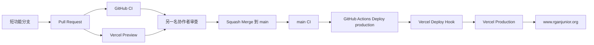

# RganJunior 完整生产发布手册

本手册是 RganJunior 发布流程的唯一事实来源，适用于 `@RuikangWNemo` 和 `@gps-china`。任何影响发布方式的 GitHub、Vercel、Supabase 或环境变量变更，都必须在同一个 Pull Request 中更新本文件。

> 本文件只记录 Secret 的名称和维护位置。不要把 Deploy Hook URL、Token、密码、数据库连接串或真实用户数据写入仓库、Issue、PR、日志或截图。

## 1. 发布架构



当前关键配置：

| 项目 | 当前约定 |
| --- | --- |
| GitHub 仓库 | `RuikangWNemo/RganJunior` |
| 唯一长期/生产分支 | `main` |
| 日常协作者 | `@RuikangWNemo`、`@gps-china` |
| CI | `.github/workflows/ci.yml` |
| 生产触发 | `.github/workflows/deploy-production.yml` |
| Vercel 项目 | `rgan-junior-roots-main` |
| 生产域名 | `https://www.rganjunior.org` |
| Supabase Production | 项目 `rganjunior`，ref `sronjswselrxewaqfcar` |
| GitHub Deploy Hook Secret | `VERCEL_DEPLOY_HOOK_PRODUCTION` |

`vercel.json` 只关闭 `main` 的 Git 自动部署。其他分支仍由 Vercel Git 集成建立 Preview。这样既保留合作者真实 Git 作者身份，又避免 Vercel Hobby 因提交作者没有项目席位而拒绝生产构建。

## 2. 谁可以做什么

| 操作 | 两名协作者 | 仅仓库/平台管理员 `@RuikangWNemo` |
| --- | --- | --- |
| 创建 Issue、分支、提交、PR | 是 | 是 |
| 查看 CI、PR 和仓库文档 | 是 | 是 |
| 查看并验证 Vercel Preview URL | 是 | 是 |
| 审查并批准对方 PR | 是 | 是 |
| 通过正常合并间接触发生产发布 | 是 | 是 |
| 查看或更换生产 Secret | 否 | 是 |
| 手动运行 `Deploy production` | 工作流会跳过 | 是 |
| Vercel Dashboard 重建、回滚、Promote | 否 | 是 |
| 应用 Supabase Production Migration | 否 | 是 |

协作者不需要加入 Vercel 项目，也不需要管理员冒充协作者重新提交。生产部署凭证是 Deploy Hook，不是 Git 作者身份。

## 3. 拉取仓库后的本地准备

CI 和 `package.json` 使用 Node.js 24。首次开发或依赖变化时执行：

```bash
git switch main
git pull --ff-only
nvm install 24
nvm use 24
npm ci
cp .env.example .env.local
```

只在本机填写 `.env.local`。不要从聊天记录复制未知来源的 Secret；需要开发凭证时由管理员通过安全渠道提供最小权限值。

开始新任务：

```bash
git switch main
git pull --ff-only
git switch -c feat/123-short-name
```

分支类型和完整协作规则见 [双人协作规范](two-person-workflow.md)。

## 4. 标准发布：代码或内容变更

这是所有普通发布的默认路径。

### 4.1 实现与本地验证

提交 PR 前运行：

```bash
npm run lint
npm run typecheck
npm run typecheck:app
npm test
npm run build
```

如果 `package.json` 或 `package-lock.json` 变化，先重新执行 `npm ci`。任何失败都应先解决，不使用空提交绕过检查。

### 4.2 推送和 Draft PR

```bash
git status --short
git add path/to/changed-file
git commit -m "feat: describe the change"
git push -u origin feat/123-short-name
```

尽早建立 Draft PR，并记录：目标、范围、验证结果、风险、回退方式、环境变量或数据库要求。不要多人共同向同一条功能分支提交。

### 4.3 CI 与 Preview

PR 更新后会发生两件事：

1. GitHub `CI / Validate` 执行安装、lint、两组类型检查、测试和生产构建；
2. Vercel Git 集成为该非 `main` 分支创建独立 Preview URL。

审查者必须在 Preview 检查至少桌面端和移动端；涉及登录或权限时，还要验证匿名、普通成员和管理员路径。Preview 成功不代表生产 Secret 或生产数据配置正确。

### 4.4 审查和合并

满足以下条件后才可使用 **Squash and merge**：

- 另一名协作者已批准；
- CI、Vercel Preview 和审查对话全部通过；
- 数据库/环境变量的前置步骤已经完成；
- PR 中写明发布后验证与回退方案。

合并后删除功能分支。不要把功能分支直接部署为 Production。

### 4.5 自动生产发布

合并到 `main` 后：

1. `CI` 在 `main` push 上重新运行；
2. 只有 CI 成功，`Deploy production` 才会调用 Deploy Hook；
3. Hook 要求 Vercel 从最新 `main` 重新构建；
4. Vercel 成功后将部署关联到 `www.rganjunior.org`。

GitHub 部署工作流成功只表示 Vercel 已接受构建请求，不代表生产构建已经完成。发布者必须继续在 Vercel 确认 Deployment 状态为 **Ready**，再执行第 9 节的冒烟测试。

## 5. Vercel 的全部当前发布方法

| 方法 | 用途 | 谁执行 | 是否日常使用 |
| --- | --- | --- | --- |
| PR 自动 Preview | 审查功能分支 | 两名协作者查看 | 是 |
| `main` CI → Deploy Hook | 标准生产发布 | 合并后自动 | 是，唯一默认方法 |
| GitHub Actions `workflow_dispatch` | 重建当前 `main` | 管理员 | 仅恢复/重试 |
| GitHub Actions 重新运行失败 Job | Hook 请求失败时重试 | 管理员 | 仅失败处理 |
| Vercel Dashboard Redeploy | 重建某个已有部署 | 管理员 | 例外 |
| Vercel Instant Rollback | 生产故障时恢复上个版本 | 管理员 | 紧急情况 |
| Vercel Promote | 将已验证部署重新指向生产域名 | 管理员 | 回滚恢复或特别发布 |
| Vercel CLI `vercel --prod` | 绕过标准链路直接生产构建 | 管理员 | 默认禁止 |

### 5.1 管理员手动重建当前 `main`

在 GitHub 打开 **Actions → Deploy production → Run workflow**，选择 `main` 后运行。工作流只允许 `RuikangWNemo` 执行；其他账号发起时 Job 会跳过。

适用于：

- Deploy Hook 请求临时失败；
- 生产环境变量已修正，需要重建当前 `main`；
- Vercel 缓存或平台故障恢复后需要重新构建。

不适用于：未合并代码、绕过失败 CI、部署某条功能分支。

### 5.2 Vercel Dashboard 重建

管理员可在 Vercel Deployment 详情页选择 Redeploy。必须确认目标 Deployment 的 Git SHA 与当前 `origin/main` 一致。环境变量变化后要选择使用当前生产环境变量重新构建。

### 5.3 CLI 直接部署

`vercel --prod` 会绕开本仓库的 GitHub CI/Hook 审批链，只能在 GitHub/Vercel 均不可用且生产急需恢复时由管理员使用。执行前必须从干净的已知提交开始：

```bash
git switch main
git pull --ff-only
git status --short
git rev-parse HEAD
vercel --prod
```

如果 `git status --short` 有输出则停止。使用后必须在 Incident Issue 记录命令、SHA、Deployment URL、原因和后续对齐 PR。

## 6. 数据库变更的发布链路

Supabase Migration 不由当前 GitHub Actions 自动执行。为避免网站自动部署先于数据库，数据库变更必须使用“扩展—启用—清理”三阶段，并由管理员串行发布。

### 6.1 创建 Migration

```bash
supabase --version
supabase migration new descriptive_name
```

只编辑 CLI 创建的 `supabase/migrations/*`。不要只在远程 Dashboard 修改生产结构。涉及公开表、View、RPC、Storage 或权限时，必须复核 RLS、`GRANT`、所有权检查与回退风险。

完成 Migration 文件后先运行不依赖新生成类型的基础检查：

```bash
npm test
npm run build
```

### 6.2 Staging 验证

Staging Project Ref 由管理员确认。若尚未建立独立 Staging，本次数据库发布必须停止，不能把 Production 临时当作 Staging。

在命令中设置明确的临时变量，避免误用之前链接的项目：

```bash
export RGAN_STAGING_SUPABASE_REF="replace-with-confirmed-staging-ref"
supabase link --project-ref "$RGAN_STAGING_SUPABASE_REF"
supabase migration list --linked
supabase db push --dry-run
supabase db push
npm run supabase:test:remote
supabase migration list --linked
supabase gen types --project-id "$RGAN_STAGING_SUPABASE_REF" --schema public > src/lib/supabase/database.types.ts
npm run typecheck
npm run typecheck:app
npm test
npm run build
```

生成的 `src/lib/supabase/database.types.ts` 必须随 PR 提交。只有已明确确认的 Staging 可以运行远程授权测试。不得针对 Production 运行 `npm run supabase:test:remote`、`supabase db reset --linked` 或测试 Seed。

### 6.3 Production 发布顺序

数据库和应用代码不要放在同一个“一步上线”中：

1. **扩展 PR**：只增加向后兼容的表、列、索引、RPC 或策略；
2. 合并扩展 PR 后，管理员从最新 `main` 检查 Production 目标；
3. 先 Dry Run，再应用 Migration；
4. 验证 Migration、RLS、关键查询和旧网站仍可用；
5. **启用 PR**：合并开始使用新结构的应用代码，走标准 Deploy Hook；
6. 稳定观察后建立独立的 **清理 PR**，移除旧结构。

Production 命令：

```bash
git switch main
git pull --ff-only
supabase link --project-ref sronjswselrxewaqfcar
supabase migration list --linked
supabase db push --dry-run
supabase db push
supabase migration list --linked
```

Production 永远不使用 `--include-seed`。如果 `migration list` 或 Dry Run 与预期不一致，立即停止；不要猜测执行 `migration repair`。

## 7. 环境变量和外部服务

| 位置 | 保存内容 | 维护规则 |
| --- | --- | --- |
| `.env.example` | 变量名与安全占位符 | 随代码提交 |
| `.env.local` | 本地开发值 | 永不提交 |
| GitHub Actions Secret | `VERCEL_DEPLOY_HOOK_PRODUCTION` | 仅管理员维护 |
| Vercel Environment Variables | Functions 和前端构建所需配置 | 分清 Preview/Production Scope |
| Supabase Dashboard | Auth URL、Email Hook、数据库配置 | 仅管理员维护 |
| Resend / Redis 提供商 | API Key、TLS Redis URL | 仅管理员维护 |

新增或改名环境变量时：

1. 更新 `.env.example` 和本手册相关说明；
2. 在 PR 写明 Local、Preview、Production 的作用域；
3. 管理员先在目标平台添加变量，再合并依赖它的代码；
4. Vercel 环境变量修改后重新部署才会进入新 Deployment；
5. 验证完成后再删除旧变量。

关键生产变量类别：

- Supabase 浏览器安全变量：`VITE_SUPABASE_URL`、`VITE_SUPABASE_PUBLISHABLE_KEY`；
- Supabase 服务端变量：`SUPABASE_URL`、`SUPABASE_PUBLISHABLE_KEY`、`SUPABASE_SECRET_KEY`；
- Auth Email：`RESEND_API_KEY`、`SUPABASE_SEND_EMAIL_HOOK_SECRET`、`AUTH_EMAIL_FROM`；
- Community/Guardian：`GUARDIAN_*`；
- 协同编辑 Redis：`COMMUNITY_COLLAB_REDIS_URL`、`COMMUNITY_COLLAB_INSTANCE_NAME`；
- 表单与通知：`JOIN_GOOGLE_FORM_*`、`JOIN_NOTIFICATION_WEBHOOK_URL`。

所有带 `VITE_` 的变量都会进入浏览器。Secret、服务端密钥和写权限 Token 绝不能使用 `VITE_` 前缀。

## 8. 特殊配置发布

### Supabase Auth URL

Production 必须保持：

```text
Site URL
https://www.rganjunior.org

Redirect URLs
https://www.rganjunior.org/community/auth/callback
https://www.rganjunior.org/community/reset-password
```

修改后验证注册、登录、邮件链接、回调和重置密码。`supabase/config.toml` 不会覆盖 hosted Dashboard 配置。

### Resend / Supabase Send Email Hook

更换发送域、From 地址或 Hook Secret 时，先在 Resend 和 Supabase 端完成配置，再更新 Vercel Production 变量并重建当前 `main`。验证邮件不得包含生产 Secret，测试收件人使用团队控制的测试账号。

### Redis / 协同编辑

Production 必须使用 TLS Redis URL。修改 Redis 配置后重新部署，并用两个浏览器会话验证协同编辑、断线重连和持久化。不要把 Redis URL 输出到构建日志。

## 9. 发布后验证

发布者在 Vercel 确认 **Ready** 后检查：

- `https://www.rganjunior.org/` 首页加载、语言切换和导航；
- `/about`、`/programs`、`/field-notes`、`/join` 主要公共页面；
- `/community/auth` 登录入口和 Auth 回调域名；
- 使用测试账号进入 `/community`，检查权限、数据读取和退出登录；
- 本次改动涉及的 API、表单、邮件、Storage、实时协作或管理页；
- Vercel Functions 日志无新增 5xx，浏览器控制台无阻塞错误；
- Production Deployment SHA 对应已合并的 `main`。

在 PR 或 Issue 留下：Deployment URL、Git SHA、验证时间、验证人、结果和未解决观察项。不要粘贴含个人数据或 Secret 的原始日志。

## 10. 失败处理

| 失败点 | 处理方法 | 禁止事项 |
| --- | --- | --- |
| 本地检查失败 | 修复后重新提交 | 不跳过或伪造结果 |
| PR CI 失败 | 查看失败步骤并推送修复 | 不合并 |
| Preview 失败 | 检查 Vercel Build Log、Root 和 Preview 变量 | 不用 Production 试错 |
| `main` CI 失败 | 建立修复/回退 PR | Hook 不应手动绕过 CI |
| Deploy Hook Job 失败 | 管理员检查 Secret/Hook 后 Re-run Job | 不把 Hook URL贴进日志 |
| Hook Job 成功但 Vercel Build 失败 | 在 Vercel 查看构建日志，修复后走 PR；必要时手动重建当前 `main` | 不用空提交反复撞构建 |
| Migration Dry Run 异常 | 停止并核对项目、历史和 SQL | 不直接 `migration repair` |
| Migration 部分失败 | 保持网站兼容，记录现场并编写向前修复 Migration | 不盲目删除生产数据 |
| 生产运行时故障 | 先恢复服务，再建立 Incident 与修复 PR | 不在聊天中无记录操作 |

## 11. 回滚与恢复

### 11.1 仅网站代码故障

1. 管理员确认当前生产确实异常并记录时间；
2. 在 Vercel 执行 Instant Rollback；Hobby 计划只能回到上一个生产版本；
3. 验证域名、关键页面和错误日志恢复；
4. 立即建立 revert/fix PR，使 `main` 与生产状态重新一致；
5. 修复版通过正常发布链后，在 Vercel Promote 新 Deployment 或 Undo Rollback，恢复生产域名自动指向。

Vercel 回滚只切换网站 Deployment，不会回滚 Supabase 数据库、外部 API 或当前环境变量。回滚前必须确认旧代码仍兼容当前数据库。

### 11.2 数据库故障

优先使用向前修复 Migration。已经删除或改写的数据不能靠 Git 或 Vercel 回滚恢复。涉及数据恢复时停止网站写入路径，由管理员根据 Supabase 备份能力制定恢复方案并记录 Incident。

### 11.3 Secret 泄露

如果 Deploy Hook URL、API Key 或数据库 Secret 暴露：

1. 立即在对应平台撤销/轮换；
2. 更新 GitHub 或 Vercel Secret；
3. 重建受影响 Deployment；
4. 检查日志和 Git 历史；如果曾提交到 Git，即使随后删除也视为已泄露；
5. 建立安全 Incident，记录影响范围而不记录 Secret 值。

## 12. 紧急发布

紧急发布仍优先使用小型 PR。另一人暂时无法响应时，管理员可以在生产不可用或存在正在利用的安全问题时缩短审批，但必须：

1. 创建 Incident Issue；
2. 只修改恢复服务所需内容；
3. 执行与风险相称的验证；
4. 记录 SHA、部署方式、Deployment URL 和回退结果；
5. 在 24 小时内由另一名协作者补审；
6. 建立后续 PR 恢复标准流程和测试覆盖。

普通截止日期、文案更新和功能演示不属于紧急情况。

## 13. 可复制发布清单

```text
[ ] Issue 和验收条件明确
[ ] 分支来自最新 main
[ ] 本地 lint / typecheck / test / build 通过
[ ] PR 已说明风险、环境变量、Migration 和回退方法
[ ] GitHub CI 通过
[ ] Vercel Preview 已完成桌面、移动与本次功能验证
[ ] 另一名协作者已批准，所有对话已解决
[ ] 数据库扩展 Migration 已先在 Staging 验证
[ ] Production 前置变量/兼容 Migration 已由管理员完成
[ ] 使用 Squash and merge 合并
[ ] main CI 通过
[ ] Deploy production 已触发
[ ] Vercel Production 状态为 Ready
[ ] 生产域名与关键路径冒烟测试通过
[ ] PR/Issue 已记录 SHA、Deployment 和验证结果
[ ] 功能分支已删除，Issue 已关闭或后续任务已建立
```

## 14. 可复制回退清单

```text
[ ] 已确认是生产故障并记录开始时间
[ ] 已判断问题属于网站、环境变量、数据库或外部服务
[ ] 已确认上一个 Vercel Deployment 与当前数据库兼容
[ ] 管理员已执行回滚/Promote/安全重建
[ ] 生产域名和关键路径已恢复
[ ] 已建立 Incident Issue
[ ] 已建立 revert 或 forward-fix PR
[ ] main、生产 Deployment 和数据库状态已重新对齐
[ ] 另一名协作者已在 24 小时内补审
```

## 15. 维护位置与官方参考

仓库配置：

- CI：`/.github/workflows/ci.yml`
- 生产 Deploy Hook 工作流：`/.github/workflows/deploy-production.yml`
- Vercel 分支策略：`/vercel.json`
- 环境变量目录：`/.env.example`
- 数据库版本：`/supabase/migrations/`
- 双人规范：`/docs/collaboration/two-person-workflow.md`

已确认的设计记录：

- [双人协作设计](../plans/2026-08-10-two-person-collaboration-design.md)
- [Production Deploy Hook 设计](../plans/2026-08-10-production-deploy-hook-design.md)
- [完整生产发布手册设计](../plans/2026-08-10-production-release-runbook-design.md)

官方参考：

- [Vercel Deploy Hooks](https://vercel.com/docs/deploy-hooks)
- [Vercel Git Configuration](https://vercel.com/docs/project-configuration/git-configuration)
- [Vercel Production Rollback](https://vercel.com/docs/deployments/rollback-production-deployment)
- [Supabase Database Migrations](https://supabase.com/docs/guides/deployment/database-migrations)
- [Supabase CLI db push](https://supabase.com/docs/reference/cli/supabase-db-push)
- [Supabase Production Checklist](https://supabase.com/docs/guides/deployment/going-into-prod)
